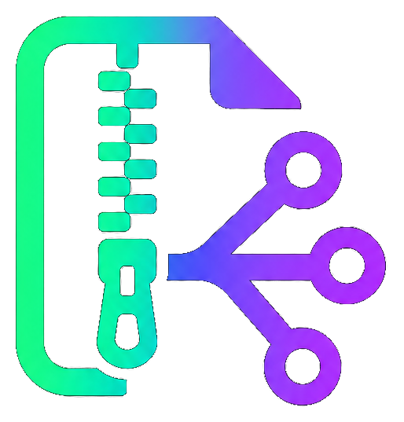
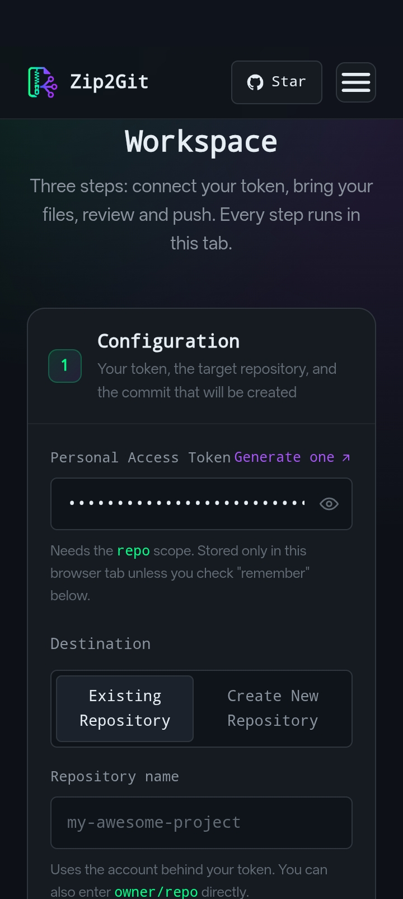
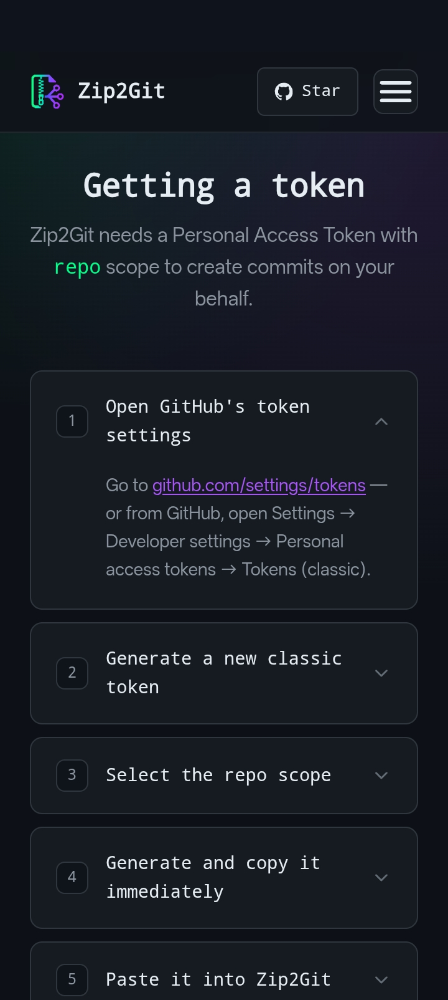
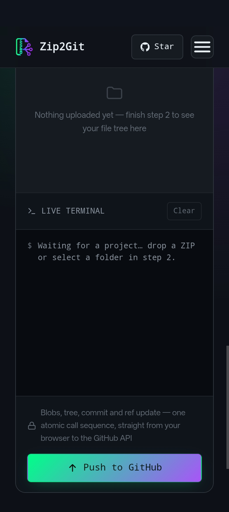

<div align="center">
  

  <h1>Zip2Git</h1>

  <p><strong>Zip a project. Drop it here. Watch it land on GitHub as one commit.</strong></p>

  <p>
    
    
    
    
    
  </p>
</div>

---

## About

**Zip2Git** takes a ZIP archive or a whole folder and pushes it into a GitHub
repository as a single atomic commit — built entirely with the GitHub **Git
Data API**, running in the browser.

There's no upload server and no middleman. Your token and your files go
straight from this page to `api.github.com` and nowhere else. If you can open
a browser tab, you can ship a project to GitHub — phone, tablet, or desktop,
no terminal and no Git client required.

---

## 📸 Showcase

<div align="center">
  <table>
    <tr>
      <td width="33%" align="center">
        <br />
        <sub><b>Connect a token, pick a repo</b></sub>
      </td>
      <td width="33%" align="center">
        <br />
        <sub><b>Review the file tree live</b></sub>
      </td>
      <td width="33%" align="center">
        <br />
        <sub><b>One push, one commit</b></sub>
      </td>
    </tr>
  </table>
</div>

---

## ✨ Features

- 📦 **Dual upload modes** — drag in a `.zip`, or select/drop a whole folder with the
  native `webkitdirectory` and `DataTransferItem` APIs
- 🌲 **100% structural integrity** — nothing is auto-excluded. `.github/workflows`,
  `.gitignore`, dotfiles, and build configs land in the commit exactly as they were
- ⚛️ **Atomic by construction** — every file becomes a blob, the blobs become one tree,
  the tree becomes one commit, and the ref only moves once that commit exists. There's
  no moment where the repo sits half-updated
- 🖥️ **A file tree you control** — every file starts checked; uncheck anything (or a
  whole folder) before it ever reaches GitHub
- 📟 **A live terminal**, not a spinner — every blob, the tree build, the commit, and
  the ref update, logged as they happen
- 🔒 **Client-side privacy** — your PAT lives in page memory (and optionally this
  browser's `localStorage`, with a one-tap clear) and is never sent anywhere but GitHub
- 🎉 **It tells you when it's done** — a confetti burst and a direct link to the commit,
  not a silent success

---

## 🧰 Tech Stack

- **Vanilla JavaScript** (ES2017+) — no framework, no bundler, no build step
- **[JSZip](https://stuk.github.io/jszip/)** for client-side ZIP extraction
- **[canvas-confetti](https://github.com/catdad/canvas-confetti)** for the payoff moment
- Native browser **File & Directory APIs** — `webkitdirectory` for folder
  selection, `DataTransferItem.webkitGetAsEntry()` for folder drag-and-drop
- **GitHub REST / Git Data API** (`git/blobs`, `git/trees`, `git/commits`, `git/refs`)
  for the actual push
- Hand-written **CSS custom properties** for the theme — no Tailwind, no UI kit

---

## 🏛️ Architecture

```
index.html        Home — hero, quick pitch
workspace.html    The app itself — config, upload, tree, terminal, push
features.html     What it does, in detail
docs.html         How it works, PAT setup, FAQ
license.html      MIT license, in full
assets/
  styles.css      Shared design system
  site.js         Nav, accordions, footer year
  workspace.js    All the app logic — only loaded here
  logo-icon.png   Navbar / footer mark
  logo-full.png   The full lockup, used in the hero
  favicon.png     Browser tab icon
```

**How a push becomes a commit:**

```
┌─────────────────────────────────────────────────────┐
│ selected files, checked in the tree                 │
└─────────────────────────────────────────────────────┘
                           │
                           ▼
┌─────────────────────────────────────────────────────┐
│ POST /git/blobs   (one call per file, 6 at a time)  │
└─────────────────────────────────────────────────────┘
                           │  base64-encode each file
                           ▼
┌─────────────────────────────────────────────────────┐
│ POST /git/trees   (base_tree = current HEAD's tree) │
└─────────────────────────────────────────────────────┘
                           │  collect the blob SHAs
                           ▼
┌─────────────────────────────────────────────────────┐
│ POST /git/commits (parents = [current HEAD])        │
└─────────────────────────────────────────────────────┘
                           │  take the new tree SHA
                           ▼
┌─────────────────────────────────────────────────────┐
│ PATCH or POST /git/refs/heads/<branch>              │
└─────────────────────────────────────────────────────┘
```

Because the tree is merged on top of the branch's current tree (`base_tree`), files
you didn't touch are left exactly as they were.

---

## 🚀 Getting Started

<div align="center">
  <a href="https://yourname.github.io/zip2git/workspace.html">
    
  </a>
</div>

You'll need a GitHub [Personal Access Token](https://github.com/settings/tokens/new?scopes=repo)
with `repo` scope — the [Docs page](https://yourname.github.io/zip2git/docs.html)
walks through generating one.

### Run it locally
```bash
git clone https://github.com/yourname/zip2git.git
cd zip2git
python3 -m http.server 8000
# → open http://localhost:8000
```
No install step, no `node_modules` — it's static HTML, CSS and JS. Any static
server (or GitHub Pages) works.

---

## 🗺️ Roadmap

- [ ] Resume an interrupted push instead of starting the blob upload over from scratch
- [ ] An "open a Pull Request" mode as an alternative to committing straight to the branch
- [ ] Per-file diff preview against the existing tree before pushing
- [ ] Fine-grained PAT support alongside classic tokens
- [ ] A clearer fallback message on browsers that don't support folder drag-and-drop

---

## 💡 Contributing

This started as a solo project, so there's no formal process yet — issues and
pull requests are welcome regardless.

---

## ⚖️ License

Zip2Git is free software licensed under the **MIT License** — see
**[LICENSE](LICENSE)**.

---

<p align="center">
  The shortest path from a folder on your phone to a commit on GitHub. 📦→🌿
</p>
